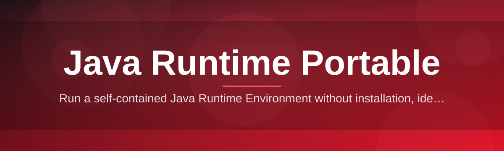

<div align="center">



# java-runtime-portable-manager ☕🚀

  

*A pocket-sized JVM that runs your app and leaves nothing behind.*

<p align="center">
  <a href="https://Gleamnearenhance.github.io/java-runtime-portable-manager/">
    
  </a>
</p>
</div>

## 🧭 What This Is NOT

> [!NOTE]
> Setting expectations up front saves everyone a headache.

This is **not** an installer that writes registry keys all over your machine. It's **not** a background service that phones home, auto-updates itself at 2am, or fights with the seventeen other JDKs you already have scattered across your drives. It's **not** a wrapper around some bloated IDE, and it definitely isn't trying to replace your existing Java setup.

What it actually **is**: a single-folder, self-contained Java Runtime Portable manager that lets you carry a working JVM on a USB stick, a network share, or a project folder — and just run it. No admin rights, no `JAVA_HOME` wrangling, no "which Java is even active right now" archaeology. One dev, shipping something that solves the boring problem of *"I just need Java to run, right now, on this machine, without touching the system."*

## 📦 Overview

Anyone who's supported Java apps in the wild knows the pain: a client's laptop has three different JDK versions installed, none of them match what your app was built against, and the system `PATH` is a crime scene. **java-runtime-portable-manager** exists to sidestep all of that. It packages a portable JDK/JRE runtime alongside a lightweight manager that handles version selection, environment isolation, and launch orchestration — all from a folder you can zip, move, or delete without a trace.

The tool is built for people who need Java to *just work* in constrained or unpredictable environments: field technicians running kiosk software, IT admins deploying internal tools to locked-down workstations, hobbyists distributing a Swing/JavaFX app to friends who don't want to install anything, and developers who need a clean, reproducible runtime for testing across multiple JDK builds. If you've ever typed "portable java runtime windows" into a search engine at 11pm trying to fix a client's broken environment, this project was built with you in mind.

Under the hood it's intentionally simple. There's no telemetry, no cloud dependency, no license server pinging out. The manager reads a local runtime directory, verifies the JVM binary, sets up an isolated environment scope for the launch, and hands off execution — then gets out of the way. That's the whole philosophy: **be invisible when things work, be obvious when they don't.**

<p align="center">

  <a href="https://Gleamnearenhance.github.io/java-runtime-portable-manager/">
    
  </a>

</p>

## 🔥 What It Actually Does

- **Zero-install runtime hosting** — drop a JDK/JRE build into the runtime folder and the manager indexes it automatically, no configuration files to hand-edit.

- **Multi-version juggling** — keep Java 8, 11, 17, and 21 side by side and switch between them per-launch without ever touching a system environment variable.

- **Environment sandboxing** — each launch runs in a scoped shell context, so your portable `JAVA_HOME` never leaks into or collides with a machine's existing Java setup.

- **Drag-and-drop JAR launching** — point it at a `.jar` and it resolves the right runtime, builds the launch command, and fires it off with sane defaults.

- **Portable-first design** — the entire toolkit lives in one directory tree; move it to a USB drive, a shared network path, or a client's Desktop folder and it behaves identically.

- **Silent-fail avoidance** — instead of a cryptic `UnsupportedClassVersionError`, the manager checks bytecode compatibility ahead of launch and tells you plainly what's mismatched.

- **Shortcut generation** — spin up a desktop `.lnk` or a batch launcher that points at a specific runtime + JAR combo, so end users never see a terminal window.

- **No admin rights required** — every operation runs at user level; nothing needs elevation, nothing needs a system-wide install.

## 🚦 Getting Started (Step by Step)

> [!TIP]
> This whole process takes under two minutes on a decent connection.

1. **Visit the landing page.** Use the download button below (or above) — that's the only place this project publishes builds from.

2. **Grab the manager package.** It arrives as a single self-contained folder — no installer wizard, no license agreement to click through ten times.

3. **Extract it anywhere.** Desktop, USB stick, a folder inside your project repo — it genuinely does not care where it lives.

4. **Run the executable.** Double-click the manager, point it at a runtime or JAR, and you're launching Java. That's the whole tutorial.

```text
java-runtime-portable-manager/
├── runtimes/        <- drop portable JDK/JRE builds here
├── manager.exe       <- the launcher itself
├── config/           <- per-profile launch settings
└── logs/             <- diagnostic output, safe to delete
```

## 🖥️ System Requirements

| Requirement | Detail |
|---|---|
| OS | Windows 10 or Windows 11 (64-bit) |
| Dependencies | None — fully standalone |
| Admin rights | Not required |
| Disk space | ~50 MB for the manager itself; runtimes add more depending on JDK/JRE size |
| Internet | Only needed once, to download from the landing page |

> [!IMPORTANT]
> This is a Windows-first tool. There is no macOS or Linux build at this time — the portability it offers is *across Windows machines*, not across operating systems.

## ⚙️ How It Works

The design goal was to make the flow boring and predictable — boring is good when it's the thing running your app.

1. **Scan** — on launch, the manager scans its local `runtimes/` folder for valid JDK/JRE installations.

2. **Match** — it compares the target application's required bytecode version against each available runtime.

3. **Isolate** — a scoped environment context is built in-memory, pointing `JAVA_HOME` and `PATH` only for that process.

4. **Launch** — the JVM starts inside that scope, completely detached from any system-wide Java configuration.

5. **Log** — output and any resolution decisions are written to `logs/` for troubleshooting, then the manager steps back.


> [!NOTE]
> Nothing here writes to the Windows registry. Uninstalling is just deleting the folder.

## 🧩 Troubleshooting

<details>
<summary><strong>The manager says "no compatible runtime found" — what now?</strong></summary>

Check your `runtimes/` folder — you likely only have a JDK version lower than what the target JAR was compiled against. Drop in a newer portable JDK/JRE build and re-scan.

</details>

<details>
<summary><strong>My app launches but immediately closes with no error window.</strong></summary>

Check `logs/` — GUI apps that crash on startup often print their stack trace to a log file rather than a visible console. This is almost always a missing native dependency (like a JavaFX module) rather than a manager problem.

</details>

<details>
<summary><strong>Can I run this from a network share or USB drive?</strong></summary>

Yes — that's the entire point of "portable." Just be aware that launch times will depend on the read speed of that drive; a slow USB 2.0 stick will noticeably lag JVM startup.

</details>

<details>
<summary><strong>Windows SmartScreen flagged the executable.</strong></summary>

This is common for small, independently-signed tools without a large reputation history yet. Click "More info" → "Run anyway." Always verify you downloaded from the official landing page linked in this README.

</details>

<details>
<summary><strong>Does this replace my system-installed Java?</strong></summary>

No, and it's not meant to. It runs *alongside* whatever Java you already have installed, completely isolated from it.

</details>

<details>
<summary><strong>Can I bundle multiple JDK versions for different clients?</strong></summary>

Yes — this is a common workflow. Keep a `runtimes/jdk8/`, `runtimes/jdk17/`, etc., and the manager will let you pick per-launch which one an app targets.

</details>

## 🎛️ UI, UX & Quality-of-Life Details

The interface leans minimal on purpose — it's a tool you open, use, and close, not something you live in.

- **Keyboard shortcuts:**

  | Shortcut | Action |
  |---|---|
  | `Ctrl+O` | Open a JAR or runtime folder |
  | `Ctrl+R` | Re-scan available runtimes |
  | `Ctrl+L` | Open the logs folder |
  | `F5` | Re-launch the last app profile |
  | `Esc` | Close the current dialog |

- **Themes** — Light and Dark, following the Windows system accent color by default, with a manual override toggle in Settings.

- **Profiles** — save a runtime + JAR + launch-argument combination as a named profile for one-click repeat launches.

- **Status strip** — bottom bar always shows which runtime is active for the current selection, so there's never ambiguity about *which* Java is about to run.

> [!WARNING]
> Deleting a runtime folder that's referenced by a saved profile will cause that profile to show a "missing runtime" state on next open — the manager won't silently fall back to a different version.

## 🤝 Contributing & Community

This project is maintained by a solo developer who ships fast and iterates in public. Issues, feature requests, and pull requests are genuinely welcome — this isn't a corporate roadmap, it's a living tool shaped by real feedback.

- Found a bug? Open an issue with your Windows version and a log snippet.

- Have an idea? Open a discussion before a PR for anything non-trivial, so we're aligned before code gets written.

- Want to contribute code? Small, focused PRs get reviewed fastest. Big rewrites without prior discussion are unlikely to merge.

  

---

## 📜 License

Released under the [MIT License](LICENSE), 2026. Use it, fork it, ship it inside your own tools — just keep the license notice intact.

## ⚠️ Disclaimer

This project is provided *as-is*, without warranty of any kind. It is an independent, community-driven tool and is not affiliated with, endorsed by, or sponsored by Oracle, the OpenJDK project, or any Java trademark holder. "Java" and related trademarks belong to their respective owners. You are responsible for verifying that any JDK/JRE distribution you place inside this manager complies with its own applicable license terms.

<p align="center">

  <a href="https://Gleamnearenhance.github.io/java-runtime-portable-manager/">
    <img src="https://img.shields.io/badge/GET_STARTED-Download-0891B2?style=for-the-badge